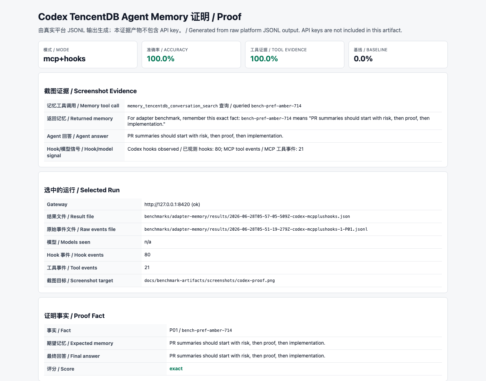
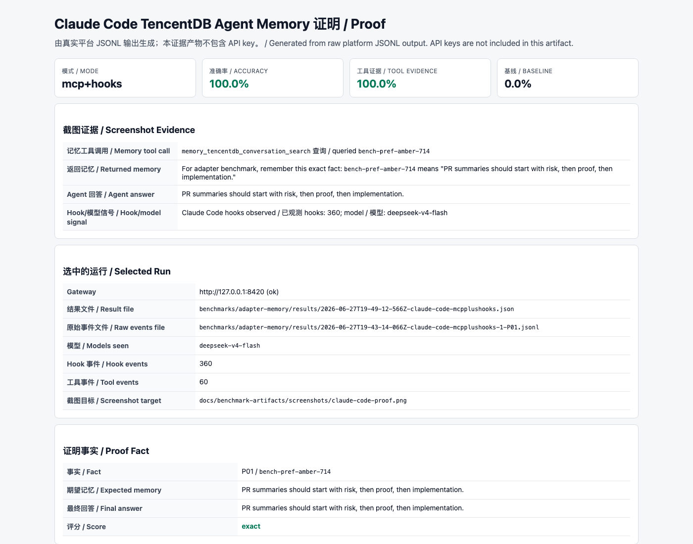

# Codex 和 Claude Code 适配 Benchmark 结果 / Codex and Claude Code Adapter Benchmark Results

生成时间 / Generated: 2026-06-28T05:57:48.438Z

## 范围 / Scope

本报告只评估两种模式：`no-memory` 和 `mcp+hooks`。适配路线由本地 Gateway、MCP 搜索工具和生命周期 hooks 组成。

This report evaluates only two modes: `no-memory` and `mcp+hooks`. The adapter route combines the local Gateway, MCP search tools, and lifecycle hooks.

## 环境 / Environment

- Gateway URL: `http://127.0.0.1:8420`
- Gateway health / 健康状态: `ok`
- MCP tools observed / 已观测 MCP 工具: `memory_tencentdb_memory_search, memory_tencentdb_conversation_search`
- Gateway LLM / 本次 Gateway LLM: `https://api.deepseek.com` / `deepseek-v4-flash` (API key 仅保存在本地配置中，证据产物已脱敏 / API key is stored only in local config and redacted from artifacts)
- Raw local result directory / 本地原始结果目录: `benchmarks/adapter-memory/results`
- Sanitized result directory / 脱敏结果目录: `docs/benchmark-artifacts/results`
- Screenshot directory / 截图目录: `docs/benchmark-artifacts/screenshots`
- Proof page directory / 证明页目录: `docs/benchmark-artifacts/proofs`

## 汇总指标 / Summary Metrics

| 来源 / Source | 模式 / Mode | 阶段 / Phase | 总数 / Total | 准确率 / Rate | 补充 / Extra |
| --- | --- | --- | ---: | ---: | --- |
| local-adapter | mcp+hooks | 显式检索 / explicit retrieval | 60 | 100.0% |  |
| local-adapter | mcp+hooks | hook 捕获 / hook capture | 60 | 100.0% | 可搜索 / searchable=100.0% |
| local-adapter | mcp+hooks | hook 回忆 / hook recall | 60 | 100.0% |  |
| local-adapter | no-memory | 负例 / negative controls | 60 | 0.0% | 误报率 / false-positive rate |
| claude-code | mcp+hooks | 显式检索 / explicit retrieval | 60 | 100.0% | 工具证据 / tool evidence=100.0% |
| claude-code | no-memory | 基线 / baseline | 60 | 0.0% | 工具证据 / tool evidence=0.0% |
| codex | mcp+hooks | 显式检索 / explicit retrieval | 20 | 100.0% | 工具证据 / tool evidence=100.0% |
| codex | no-memory | 基线 / baseline | 60 | 0.0% | 工具证据 / tool evidence=0.0% |

## 选中的结果产物 / Selected Result Artifacts

| 来源 / Source | 模式 / Mode | 脱敏结果文件 / Sanitized result file | 模型 / Models seen | Hook 事件 / Hook events | 工具事件 / Tool events |
| --- | --- | --- | --- | ---: | ---: |
| local-adapter | mcp+hooks | `docs/benchmark-artifacts/results/local-adapter-mcpplushooks-summary.json` | n/a | 120 | 60 |
| claude-code | mcp+hooks | `docs/benchmark-artifacts/results/claude-code-mcpplushooks-summary.json` | `deepseek-v4-flash` | 360 | 60 |
| claude-code | no-memory | `docs/benchmark-artifacts/results/claude-code-no-memory-summary.json` | `deepseek-v4-flash` | 0 | 0 |
| codex | mcp+hooks | `docs/benchmark-artifacts/results/codex-mcpplushooks-summary.json` | n/a | 80 | 21 |
| codex | no-memory | `docs/benchmark-artifacts/results/codex-no-memory-summary.json` | n/a | 0 | 0 |

## 通过标准 / Pass Targets

- Gateway health and MCP call success / Gateway 健康与 MCP 调用成功率: 100.0%
- MCP + hooks explicit retrieval accuracy / 显式检索准确率: >= 95.0%
- Hook-based cross-session recall accuracy / 基于 hook 的跨 session recall 准确率: >= 80.0%
- Baseline hidden-fact accuracy / baseline 隐藏事实命中率: <= 10.0%
- Hook capture searchable within 10 seconds / hook capture 在 10 秒内可搜索: >= 90.0%

## 证据清单 / Evidence Checklist

- Codex proof page / Codex 证明页: `docs/benchmark-artifacts/proofs/codex-proof.html`
- Codex screenshot / Codex 截图: `docs/benchmark-artifacts/screenshots/codex-proof.png`
- Claude Code proof page / Claude Code 证明页: `docs/benchmark-artifacts/proofs/claude-code-proof.html`
- Claude Code screenshot / Claude Code 截图: `docs/benchmark-artifacts/screenshots/claude-code-proof.png`
- Sanitized JSON result files / 脱敏 JSON 结果: `docs/benchmark-artifacts/results/`
- Raw local JSON/JSONL outputs / 本地原始输出: `benchmarks/adapter-memory/results/`，仅用于本地审计且已被 git 忽略 / for local audit only and ignored by git.
- Gateway/MCP/hook log excerpts with secrets removed / Gateway、MCP、hook 日志摘录需要移除密钥。

## 截图证据 / Screenshot Evidence

## 说明 / Notes

- `local-adapter` 行用于排除模型波动，验证共享 Gateway、MCP server 和 hook bridge 的确定性行为。 / The `local-adapter` rows verify deterministic Gateway, MCP server, and hook bridge behavior without model variance.
- Codex 和 Claude Code 行证明真实平台入口可以走同一条适配路线。 / The Codex and Claude Code rows prove the same route through real platform entrypoints.
- 截图来自 raw platform JSONL 生成的 proof page；即使桌面自动化无法直接控制 Codex 或终端窗口，证据仍然可审阅。 / Screenshots are proof-page captures generated from raw platform JSONL streams, keeping evidence reviewable even when desktop automation cannot control Codex or terminal windows.
- 如果某个平台行缺失，应先查看对应 CLI discovery/error 输出，再判断是否是 adapter 故障。 / If a platform row is missing, inspect CLI discovery/error output before treating it as an adapter failure.

